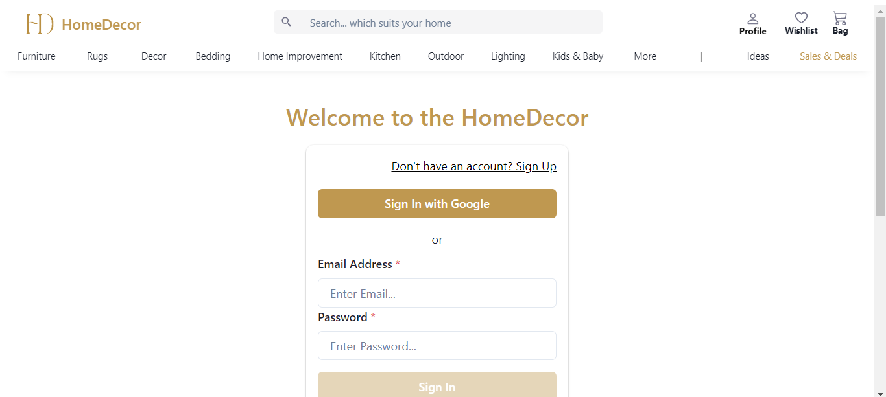
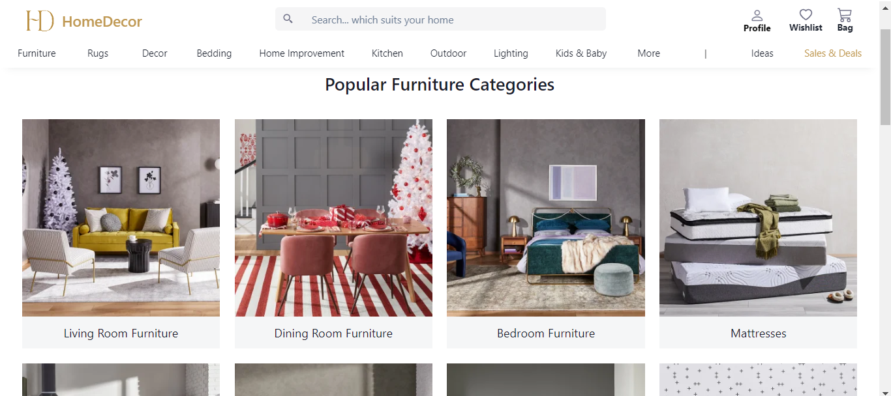

<h2 align="center" >HomeDecor </h2>

 <h3>HomeDecor is a website where user can search for home decoration products like furnitures , kids toys and many more.</h3>

## Technologies we used
ReactJS | React-Redux | CSS | Chakra UI | MongoDB | NodeJS | ExpressJS 

 ## Team Members:-
- Vijay Singh Rathore 
- Shahbaz Ali 
- Amit Singh Chauhan
- Sirtaj Khan
- Lakhan Kumar 

<h2>Home Page</h2>

<h2>Signin Page</h2>

<h2>Products</h2>

<h2>Product</h2>

<h2>Admin</h2>

 
 <h3 align="center"><i>Thank You for visiting our Project Repository.</i></h3> 

